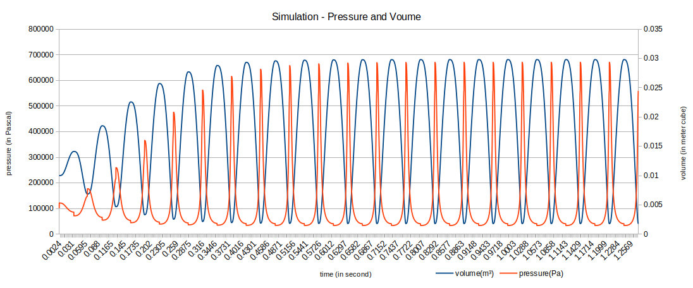

# Simulate Thermo-dynamic cycle

Here the simulation is based on Quasi-equilibrium Processes.
For a quick glance scroll down for pressure and volume time lapse line chart.

### Design aspects

This program can be understood considering two parts:

1. First one is the library, which has an interface and a definition.
2. Second part is the client code, which help in knowing the usage of library.

#### More on library part

The interface is developed with an objective to never change (but free to extended).
Keeping this in mind, the data structure in use should be hidden from client code too.
One way to hide internal data structure, is using opaque pointer at the interface.
So an opaque pointer named 'device' is declared in header file: 'thermodyn_client.h'.
Whereas definition of 'device' is placed in 'thermodyn_client.c'.

Are there any more advantages of such design?
Yes, opaque pointers allow to extend the internal data structure and client part doesn't know.
The functions exposed to client (interface) also doesn't need to change.

Basically if client code is compiled,
it doesn't need to compile again to link with the changes done only on library part.

### What simulations are attempted?

The client code containing a main() function described here.

#### Initialization part

An opaque pointer named 'device' started with 10L of air at 300K temperature (assumed values).
Now this initial state will exert 101.325 kPa pressure if not external pressure applied.
The pressure value is taken from standard temperature and pressure STP standards with SI units.
This initial state is set by calling init() function which is part of library.

#### Theory behind this simulation

Now there are two operations performed on this device:

1. Pressure increase or decrease holding isometric state.
2. Volume increase or decrease holding isothermal state.

The above two operations can be used to implement all four cycles of ideal Stirling engine.
These operations are converted to functions in the library and are called from client code.
A combinations of these functions makes complete thermodynamic cycle from client side.
The change in pressure, volume and temperature can be know after an operation complete.
A operation completes once an equilibrium is achieved.
The post equilibrium values of pressure, volume and temperature are based on:

1. 'Gay-Lussac's pressure-temperature law' (at constant volume or isometric process)
2. 'Boyle's law' (at constant temperature or isothermal process)

#### Resource deinitialization part

Every client code must end by calling deinit() which frees the resources allocated.

### Build and test

#### Dependency

1. Currently tested on Linux based OS.
2. Needs 'make' and 'gcc' commands to compile (sudo apt-get install build-essential).
3. Needs 'lcov' installation for 'geninfo' and 'genhtml' commands (sudo apt-get install lcov)

#### usage

Compile the basic test code using GNU make

	$ make
	gcc thermodyn_client.c -c -I./ -o thermodyn_client.o
	gcc thermodyn_helper.c -c -I./ -o thermodyn_helper.o
	gcc thermodyn_client.o thermodyn_helper.o -I./  -o thermodyn_cycle -lm

Run the test code and collect the results likes, volume, pressure, temperature,
time taken and work done at each cycle. We can also provide the number of cycles
to be ran. The number of cycles can be passes as an argument to executable.
By default the test code will run one cycle, prints the results and exit.

	$ ./thermodyn_cycle
	# At initial state
	volume(m³)	pressure(Pa)	temperature(K)	time(s)	workdone(J)
	0.0100 m³	  101325 Pa	        300 K	0.000 s	0.000 (J)
	# After increasing pressure for about 20%
	volume(m³)	pressure(Pa)	temperature(K)	time(s)	workdone(J)
	0.0100 m³	  121590 Pa	        360 K	0.000 s	0.000 (J)
	# After letting gas to increase its volume as per isothermal expansion
	volume(m³)	pressure(Pa)	temperature(K)	time(s)	workdone(J)
	0.0141 m³	   86116 Pa	        360 K	0.032 s	419.443 (J)
	# After decreasing pressure below original one
	volume(m³)	pressure(Pa)	temperature(K)	time(s)	workdone(J)
	0.0141 m³	   71763 Pa	        300 K	0.032 s	419.443 (J)
	# After letting gas to decrease its volume as per isothermal contraction
	volume(m³)	pressure(Pa)	temperature(K)	time(s)	workdone(J)
	0.0069 m³	  147746 Pa	        300 K	0.062 s	1151.135 (J)

Further we can check the code coverage using following make target `cov`.

	$ make cov      # for coverage report generation
	                # to also html report generated under ./coverage/index.html can be view

### Simulation results

The above result is obtained by collecting output of `./thermodyn_cycle 12` or more cycles.
Basically we can redirect this to a file for example: `./thermodyn_cycle 12 > test.csv`
and remove lines starting with `#` symbol.
Then format it as if it's tab or comma separated. Save the file as `.csv` and open it again
using a spread sheet application and generate the line chart like the one above.
You play around with pressure, volume and work done parameters with respect to time.
